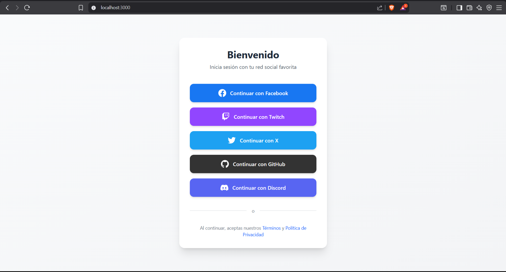
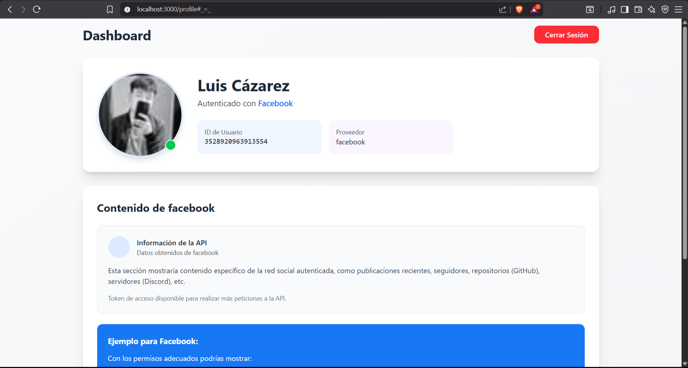
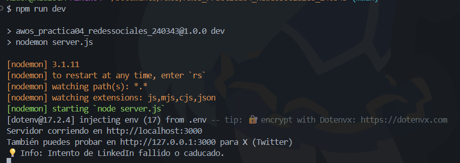
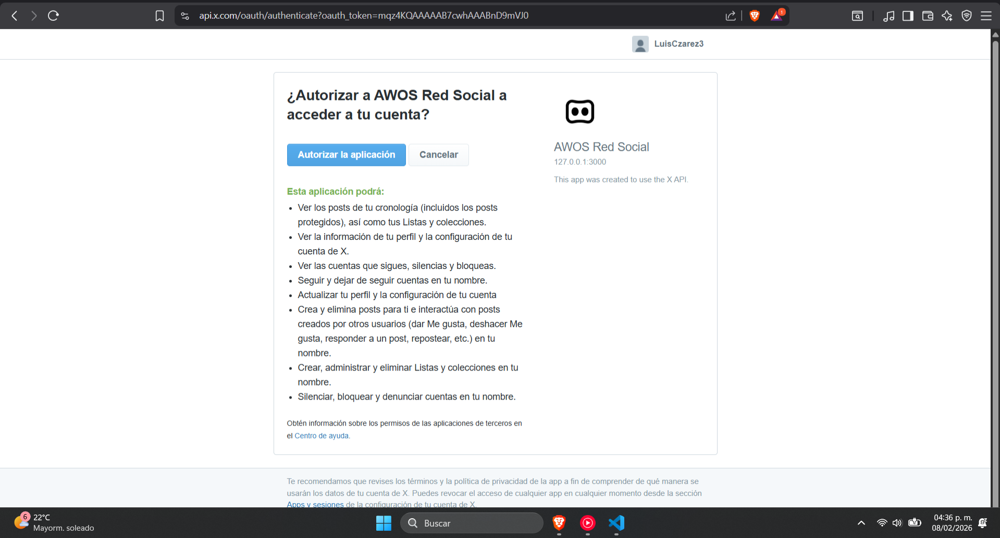
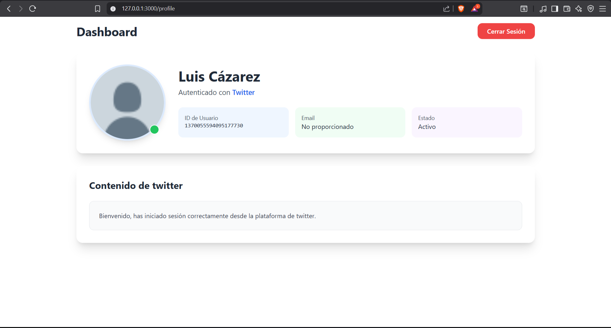

## Práctica 04: Consumo de APIs para Redes Sociales
---

 En esta práctica se creará una aplicación web que implemente autenticación OAuth 2.0 con cinco redes sociales (Facebook, LinkedIn, X/Twitter, GitHub y Discord), utilizando Node.js, Express, Passport.js y Tailwind CSS 4.x. La aplicación permitirá a los usuarios iniciar sesión con sus cuentas sociales y mostrará en un perfil personalizado información básica de su perfil obtenida de cada API. 

---
#### Consideraciones:

 Esta práctica será desarrollada con estructura de ramales por cada fase, para que el estudiante continúe practicando la manipulación correcta de ramas en el contexto de control de versiones y desarrollo colaborativo utilizando Git y GitHub. Se enfatizará en la configuración segura de credenciales OAuth y el consumo básico de datos de perfil de cada API social. 

### Tabla de Fases

|No.|Descripción|Potenciador|Estatus|
|---|---|---|---|
|1.| Configuración inicial del Proyecto | 3 | ✅ Finalizado |
|2.| Configuración de Tailwind CSS 4 | X | ✅ Finalizado |
|3.| Configuración del Servidor Express | X | ✅ Finalizado |
|4.| Configuración de API Keys Gratuitas  | X | ✅ Finalizado |
|5.| Implementación de Passport y Estrategias OAuth | X | ✅ Finalizado |
|6.| Creación de Vistas con Tailwind CSS | X | ✅ Finalizado |
|7.| Página de Perfil y Consumo de API | X | ✅ Finalizado |
|8.| Pruebas y Documentación | X | ✅ Finalizado  |

### Resultados obtenidos:

1. Visualización de la Página

****

2. Validacion de Facebook

****

2.1 Logueo de facebook

****

3. Validacion de Linkedin

****

3.1 Faltante de Validacion de Linkedin

****

4. Validacion de Twitter/X

****

4.1 Logueo de Twitter/X

****

5. Validacion de GitHub

****

5.1 Logueo de GitHub

****

6. Validacion de Discord

****

6.1 Logueo de Discord

****